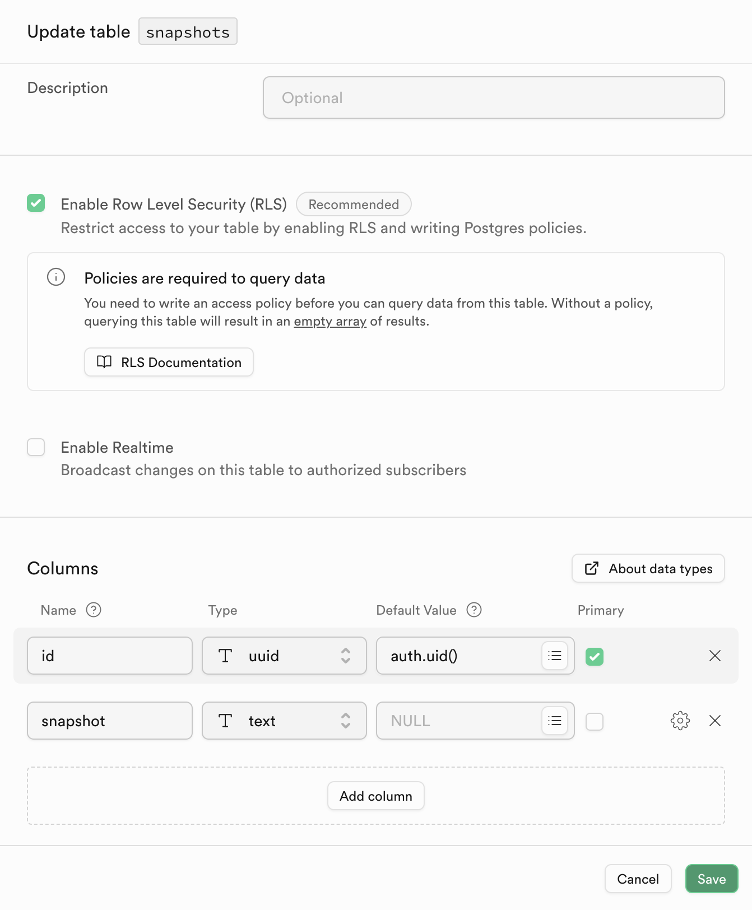
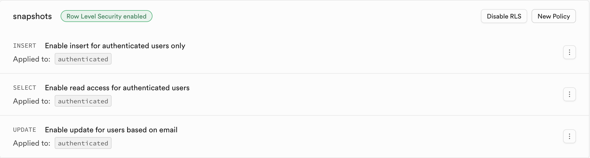

# Thinker - A free and Basic version of Milanote. 

Most of the note taking apps do a lot of things, ending up not doing anything. There was a need of an alternative that worked as a Whiteboard with Sticky notes to dump Ideas and do mind mapping and in came Thinker. It is basically [Tldraw](https://github.com/tldraw/tldraw) wrapped with [Electron Forge](https://www.electronforge.io/) to make a desktop app with cloud persistance in [Supabase](https://supabase.com/).

## Use the Application
The **Windows** and **Mac** version of the app can be found [here](https://arjunchangeeachary.wixsite.com/thinker). This has cloud persistance included in supabase included in it.

## Self Hosting

This has two steps.
1. Create a free supabase project with the necessary policy and database
2. Build the application in your system.

### Supabase Project Setup
1. Create a new [Supabase Project](https://supabase.com/).
2. Create  new Table called `snapshots` inside your new project. The table should look like this image below:


3. Now add the following Policies to the table:



For more details please go through [supabase docs](https://supabase.com/docs) on how to do this.

### Building the application

1. Run `git clone https://github.com/arjunacharya10/thinker.git`
2. Run `cd thinker`
3. In `src/app.jsx` in line **9**
    `export const supabase = createClient('<YOUR PUBLIC URL>', '<YOUR ANON KEY>')`
    replace the values of public url and anon key found here: 
    ```
    In your project dashboard > Go to projet settings > Under configuration select API. You can find the anon key and public url there.
    ```
    Ensure you have completed [Supabase Project setup](#supabase-project-setup)
4. After that Run
    ```
    npm run make
    ```
    It will create the distributable in an `out` folder which will have .exe in case of a windows system and .dmg for a mac system and you can run the application

## Lets build together
I am a novice developer but realised such a product will help the community a lot so if you are a solid developer and would love to work on building this opensource platform, pleace reach out to: `arjunchangeeacharya1998@gmail.com`.


